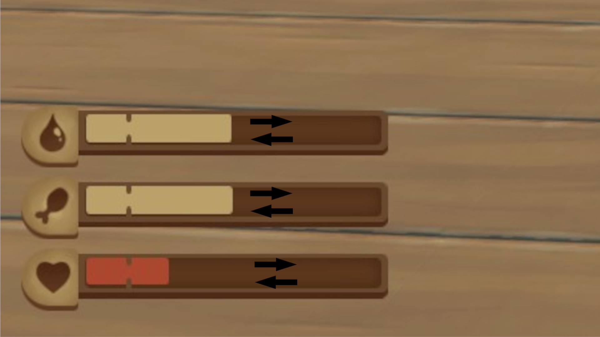

# HealthSetter   [![Badge License]][License]

*A **[Raft]** mod to change your status values.*

<br>
<br>

<div align = center>

[![Button Raft]][RaftModding]

<br>
<br>



</div>

<br>
<br>

## Commands

### Help

*Display this mod's help dialog.*

```shell
healthhelp
```

<br>

### Refill

*Refill all your status bars.*

```shell
refill
```

<br>

### Health

*Sets your health to the given amount.*

```shell
sethealth <Amount>
health <Amount>
```

<br>

### Thirst

*Sets your thirst to the given amount.*

```shell
setthirsty <Amount>
thirsty <Amount>
```

<br>

### Hunger

*Sets your hunger to the given amount.*

```shell
sethunger <Amount>
hunger <Amount>
```

<br>

### Oxygen

*Sets your oxygen to the given amount.*

```shell
setoxygen <Amount>
oxygen <Amount>
```

<br>


<!----------------------------------------------------------------------------->

[RaftModding]: https://www.raftmodding.com/mods/health-setter
[Raft]: https://raft-game.com/

[License]: LICENSE


<!----------------------------------[ Badges ]--------------------------------->

[Badge License]: https://img.shields.io/badge/License-AGPL3-015d93.svg?style=for-the-badge&labelColor=blue


<!---------------------------------[ Buttons ]--------------------------------->

[Button Raft]: https://img.shields.io/badge/RaftModding-3498db?style=for-the-badge&logoColor=white&logo=Wireshark
